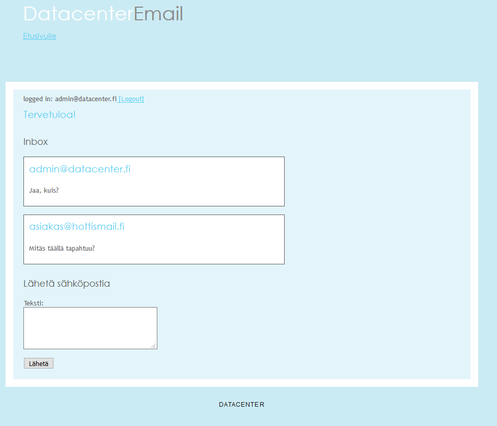

## Red Team Syöte Haitallinen sähköposti

DataCenterille luotuun sähköpostia mallintavaan PHP-sivulle laitetaan haitallisen linkin sisältävä viesti.
Viestejä tulee "oikeilta asiakkailta" sekä haitalliselta toimijalta. Blue Teamin pitää osata erottaa oikeat viestit
vääristä ja olla avaamatta haitallisia linkkejä. Haitallista linkkiä varten on luotu www.datacentre(.)fi domain, jossa sijaitsee hyökkääjän ylläpitämä palvelin. [Täältä löytyy kyseisen PHP ohjelman lähdekoodi](../OwnCloud/email)

### Blue teamin reaktio

Blue Team raportoi asiasta, mutta ei aiheuta kiirreellisiä toimenpiteitä, mikäli linkkiä ei avata.

### Kuva sähköpostipalvelusta

